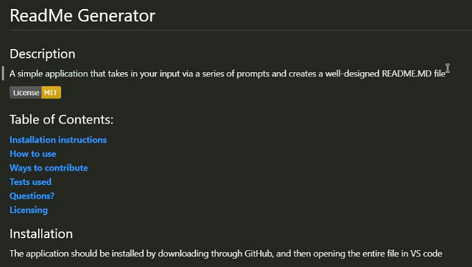
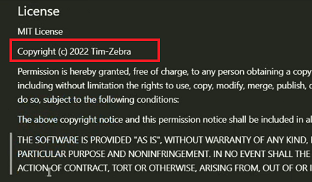
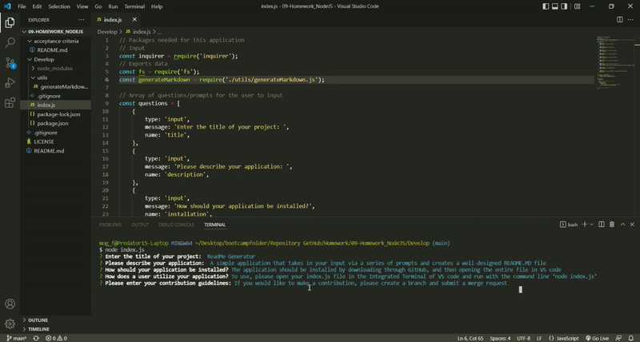

# Create-ReadMe_from_ReadingYou
UT Bootcamp Homework #9 - ReadMe Generator

## Description:
A simple ReadMe generator that creates a new ReadMe.md file based off the user's prompts  
This generator also applies date and name to your license if applicable 

## How to Use:
Open the index.js file in the Integrated Terminal of VS code and run with the command line ‘node index.js’  
Answer the prompts generated in the terminal

## Website Visual Demo(Gif/video):
  
  
  
  
<a href="https://drive.google.com/file/d/1WHOiYjj1GivxNXra8jsx9YeR4iRSTeOa/view">Video Demo</a>  

## Link to Deployed Page:
N/A

## References:
Badges obtained from - gist: https://gist.github.com/lukas-h/2a5d00690736b4c3a7ba

## Development Process (See commits for more details):
Loaded base programs  
Pseudocoded guided by acceptance criteria  
Made sure each function ran as intended  
Ensured input was stored correctly  
Ensured output was displaying as intended  
Added section info replacing specifics from data object  
Tested each section   
Sections were added together once passing  